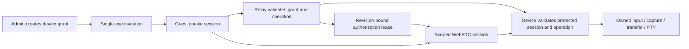

# Temporary Browser Access

Status: initial browser sharing implementation, 2026-10-03. Invitation/session
storage, the admin editor, guest screen/input UI, scoped signaling, device leases
and acknowledged cancellation are implemented. Physical-device and production
qualification remain open. Native controller applications are outside this scope.

The enabled registry is `protocol/guest-permissions.json`: `screen.view`,
`input.touch`, `input.keyboard`, `input.button.home`, `input.button.lock`,
`input.button.volume`, and `input.button.system_ui`. View-only is the default;
screen viewing is currently required. The broader vocabulary below is a delivery
plan, not an available set of grants. Audio, camera, typed commands, media, files,
automation and terminal remain disabled for guests until their execution and
resource ownership are implemented. Admin and native-controller scopes do not
silently authorize any of these operations.

## Decision

Add device-bound guest grants to the existing relay. An administrator creates
a single-use invitation with explicit permissions and an absolute end time.
The recipient claims it into a separate browser session and uses the canonical
`web/` control client without an admin login. The relay and device both enforce
the grant; the browser renders the available actions but is not an authority.

Reuse the existing revision, cancellation, capability-negotiation, and
device-local authorization-lease design. Extend it for a guest principal rather
than representing a guest as an administrator or pretending it is a native
controller with a P-256 key. Keep the existing controller contract intact until
a separately qualified migration introduces the same fine-grained vocabulary.

Do not add an external identity provider, policy engine, or new transport for
this feature. SQLite transactions and typed policy checks fit the current
single-relay architecture. Horizontal relay scaling is a separate decision:
multiple instances would require shared revocation and session routing.

## Architecture Baseline And Remaining Gaps

The table records the pre-implementation baseline reviewed at `f8e213e`.
Guest screen/input now use a separate `/guest/control` entry and `/api/guest/signal`,
with no device identifier in the invitation or browser bootstrap. Owner routes
remain independently authenticated. The unrestricted proxy and process-global
command/transfer paths in this baseline remain unavailable to guests.

The root README describes installation and public support; it should not claim
guest access until the complete path is qualified. There is no single runtime
entry point for this feature. The important ownership boundaries are:

| Boundary | Current behavior | Required change |
| --- | --- | --- |
| `relay/internal/relay/server.go`, `control_handlers.go` | `/control/devices/{id}` requires `withAdmin`; injects full-access proxy, stream, terminal and signaling paths | A separate guest entry and bootstrap containing only guest paths and effective permissions |
| `signal_handlers.go`, `controller_permissions.go` | Native signals carry scopes and grant revision; live changes cancel signals; device challenges validate the current revision | Guest-owned signals, absolute expiry, device binding and the same fail-closed lease discipline |
| `core/net/WebRTCBridge.cpp`, `WebRTCPermissions.cpp` | Native scopes select channels; `device.control` groups touch, keys and pointer; `audio.listen` enables playback and room microphone | Fine-grained channel/message checks and an explicit guest authorization mode |
| `tunnel_handlers.go`, `stream_handlers.go`, `term_handlers.go` | Admin-only tunnels forward broad device operations | Typed guest operations and guest-owned cancellation; no guest access to the unrestricted proxy |
| `core/net/RelayClient.mm` | HTTP/stream/terminal tunnels reach unauthenticated loopback APIs | A protected guest dispatcher retaining principal, revision, constraints and ownership through execution |
| `daemon/main.mm`, `core/net/HttpStreamServer.mm` | Root APIs; alternate input paths; process-global file transfers, recording and output state | Session-aware command/resource ownership and validation before side effects |
| `core/net/MediaLibrary.mm` | Media metadata exposes paths; originals are downloaded through file routes; delete token state is global | Asset-scoped preview/export and principal-bound confirmation tokens |
| `web/src/App.tsx`, `lib/rctl.ts`, `lib/engine.ts`, panels | All panels assume owner access; signaling constructs a device-ID route; automatic startup and input hooks assume permission | Explicit access context used by UI, engine, transfers and startup effects |

The current ten controller scopes are not a complete guest policy. In particular,
native `files` DataChannels intentionally remain disabled because reply/transfer
ownership is process-global. HTTP guest access must not bypass that safety
decision. A scope appearing in the admin editor does not prove that a native
application implements the corresponding feature.

`/v1/script` accepts a bounded UI action sequence (touch, key, text, launch,
button and wait), not arbitrary shell code. Its delayed actions currently lack
guest grant ownership; acceptance-time authorization alone would let a queued
action execute after revocation. The browser's current Record HUD records and
replays input macros; it is not a screen-video recording implementation.

System Inspector currently lists packages/tweaks, toggles tweaks, removes
packages, and downloads existing package files. A package-install workflow is
not implemented there; adding a checkbox must not advertise that feature.

## Security And Product Limits

1. A grant names exactly one approved device and one relay. Knowing its public
   ID grants nothing. Remove the device ID from the invitation and guest routes
   for clarity and reduced disclosure, not as an authorization mechanism.
2. Until claim, anyone holding the invitation can claim it. A display name is
   not verified identity. Single-use prevents subsequent claims, not interception
   before the intended friend. For stronger assurance, optionally require owner
   approval after claim; email accounts and passcodes are not required for v1.
3. After claim, the link alone cannot start another session. Browser cookies are
   bearer credentials; they do not have the native controller's key-bound proof
   of possession. XSS or theft of an active cookie remains a relevant threat.
4. Screen viewing allows saving displayed pixels and observing everything shown
   on the device, including other applications. Disabling the application's
   screenshot/record button cannot prevent external capture. Media preview
   without original download is enforceable; prevention of copying the preview
   is not. Revocation cannot erase bytes already delivered.
5. Touch/text/keyboard control can operate Settings or another app's own terminal,
   share media through that app, and change data visible on screen. Permissions
   constrain rctl APIs, not the semantics of arbitrary actions in iOS apps.
   Never market interactive access as an OS sandbox.
6. Root terminal and package install/remove can execute root code, including
   package lifecycle scripts. Unrestricted root file access can expose device
   credentials or install persistent code. These grants are effectively device
   administration even if other checkboxes are off.
7. Independent LAN access remains unauthenticated. A guest who can also reach
   port 8080 can bypass relay restrictions. Guest sharing must explain this
   condition and offer the existing explicit Relay-only policy; it must not
   silently change that policy. A guessed LAN address is not a safe fallback.
8. A trusted relay remains part of the authority chain. This feature does not
   make device execution safe against a compromised relay administrator.

## Invitation And Browser Session

Use a URL of the following form, generated from the configured HTTPS origin:

```text
https://relay.example/share/<random-invitation-id>#<256-bit-random-secret>
```

Both values are independent of device identity. Store only a keyed hash of the
secret, domain-separated from other token classes. Return plaintext once to
the creator; list responses cannot reconstruct a link. Generate QR locally.
No URL shortening or third-party QR services.

The landing page is a small first-party shell. Read the fragment into memory
and immediately remove it with `history.replaceState`. Never persist it in
localStorage/sessionStorage, error metadata or analytics. No external scripts,
images, fonts, service-worker caching or redirects before secret removal.
Use `Cache-Control: no-store`, `Referrer-Policy: no-referrer`, frame blocking
and a restrictive CSP. A fragment avoids transmission in HTTP requests and
Referer, but remains visible to the browser, extensions and the application
that carries the link; it is not intrinsically leak-proof.

GET must not consume an invitation: messaging previews and security scanners
can fetch it. An explicit Join action sends a same-origin JSON POST containing
the secret. Atomically check expiry, unused/revoked status, approved device,
limits and constraints before consuming it and creating the guest session.
The current implementation rejects claims while the device is offline or lacks
guest support; a retry can succeed before the original claim deadline. Device
availability cannot extend the grant deadline or authorize a different device.

The response sets a separate host-only Secure/HttpOnly/SameSite=Strict guest
cookie, preferably `__Host-rctl_guest` (`Path=/`, no Domain). Guest endpoints
ignore the admin cookie even when the same browser has both. Admin endpoints
never accept the guest cookie. Do not union principals or redirect a denied
guest operation to an admin route. Cookie Path is not a security boundary.

Keep claim retries recoverable without making an invitation reusable. Before
Join, establish a short-lived server-generated HttpOnly claim-binding cookie
with no device authority. Bind the atomic claim to its keyed hash. If the claim
response is lost, the same binding can recover that claim for a short bounded
window, invalidate any undelivered session credential and receive a fresh one;
another browser/binding cannot consume or recover it. Successful acknowledgement
ends recovery and clears the binding. Bound provisional rows and recovery
attempts; do not log either credential. Concurrent retry/acknowledgement and
multiple invitations in one browser require explicit transactional tests.

The control URL can then be `/guest/control`; resolve the device entirely from
the session. v1 supports one active guest identity per browser cookie jar. Joining
another invitation is rejected until the guest explicitly ends the previous
session; multiple tabs of
the same session can reconnect within bounded connection limits. Supporting
simultaneous independent grants later needs an explicit session selector.

Use one claim, one active guest session, one hour of absolute access by default,
and a claim deadline of at most 15 minutes or the grant end, whichever is sooner.
The API accepts durations from one minute to 24 hours; the editor offers five
minutes, 15 minutes, one hour, four hours and 24 hours. An owner can issue another
invitation for another recipient. After claim, the original URL opens no new
authority; the same authenticated browser can return to its guest control page.
Offer End session, expiry countdown, allowed actions, offline/reconnecting and
revoked/expired states. An optional five-minute idle timeout is independent of
the hard deadline; active WebRTC must have explicit authenticated liveness.

## Permission Vocabulary

Permissions describe operations, not tabs. Presets expand to explicit stored
sets and are never runtime wildcards. Every operation also checks device
binding, current revision, expiry, capability and resource constraints. Unknown
operations or permissions fail closed. Do not imply touch, files, microphone,
camera or clipboard access from `screen.view`.

The following is the target vocabulary. Only the seven registry entries listed
above are currently grantable. All other permissions remain unavailable; adding
a registry entry requires complete device enforcement and ownership first.

| Group | Proposed permissions | Meaning and restrictions |
| --- | --- | --- |
| Device information | `device.info`, `device.diagnostics` | Minimal status versus reviewed diagnostics; exclude credentials, relay configuration, private endpoints and unnecessary identifiers |
| Screen | `screen.view`, `screen.capture` | Live video versus device-created full-resolution snapshot; local screenshot/export controls are convenience restrictions only |
| Input | `input.touch`, `input.pointer`, `input.keyboard`, `input.text`, `input.button.home`, `input.button.lock`, `input.button.volume`, `input.button.system_ui` | Independent touch, relative pointer, validated keyboard usages, text insertion and named button groups. Keyboard access does not imply consumer/system HID commands |
| Device settings | `device.settings` | Explicit allowlist for brightness, orientation and device output volume/mute; viewer-local volume/zoom needs no device permission |
| Clipboard | `clipboard.read`, `clipboard.write` | Separate read and overwrite; neither follows from text input |
| Applications | `apps.list`, `apps.launch`, `apps.open_url` | Optional bundle-ID allowlist and URL scheme/host constraints; arbitrary custom URL schemes are elevated |
| Playback audio | `audio.playback.listen` | Receive device playback; session-owned capture demand, not permission to mute the device or stop another listener |
| Device microphone | `microphone.listen`, `microphone.record` | Receive room microphone versus device-side recording; exports require separate artifact authority |
| Talk | `talk.speaker`, `talk.virtual_microphone` | Browser microphone to device speaker versus injection into an app's microphone; both requires both permissions and an owned route |
| Camera | `camera.view`, `camera.capture`, `camera.record` | Live stream, still capture, device-side recording; optional front/rear constraint and foreground/API availability checks |
| Capture export | `capture.download` | Download snapshots/recordings belonging to this session; never arbitrary `/tmp` or recording paths |
| Photos/media | `media.browse`, `media.preview`, `media.download`, `media.delete` | List metadata, rendered previews, original exports, protected Photos deletion; optional selected-asset/album constraints |
| Files | `files.list`, `files.preview`, `files.download`, `files.upload`, `files.overwrite`, `files.delete` | Explicit roots plus relative paths; upload creates new files unless overwrite is separately granted; preview has bounded types/sizes |
| Automation | `automation.run` | UI macro permission AND permission for every constituent action; all delayed work belongs to the grant and is cancellable |
| Feedback | `feedback.toast`, `feedback.alert`, `feedback.speech`, `feedback.sound`, `feedback.visual` | Independent notifications, speech, sound and bounded flash/banner effects; combo effects require every underlying permission |
| System inventory | `system.inspect`, `system.package.download` | Reviewed package/tweak metadata versus export of selected installed package files; not arbitrary filesystem access |
| System changes | `system.tweak.toggle`, `system.package.remove`, `system.respring` | Target allowlists and protected package checks; destructive confirmation remains mandatory |
| Future features | `system.package.install`, `screen.record` | Installation needs its own verified workflow; device-side screen recording is distinct from input macros and browser pixel capture |
| Device update | `device.update` | Signed transactional rctl update, target restrictions and explicit owner-authorized device workflow; no relay server update |
| Terminal | `terminal.root` | Root PTY access, explicitly displayed as full device administration; no promise that other device restrictions survive |

Viewing media does not automatically allow file downloads; viewing camera does
not imply viewing Photos. Preview responses must be rendered derivatives and
reviewed metadata, not originals hidden behind a different Content-Type. Video
playback must state whether it transfers original video or a derivative.
If only original playback exists, require `media.download` or leave preview
unsupported. Reading arbitrary files overlaps media and capture grants;
constraints determine which objects are actually reachable.

Presets: View only (`screen.view` plus minimal connection status); Assist
(screen plus selected touch/pointer/keyboard/text/buttons); Media review
(selected media browse/preview); File exchange (one exchange root with explicit
directions); Custom. Elevated operations are off in every ordinary preset.
Minimal connection metadata is always sufficient to show guest status and does
not expose a full device inventory. A guest may have only media or files rights:
the client must work without automatically starting a screen session.

Permissions such as `screen.capture` and original download remain useful for
server resource control and product UX, even where they cannot prevent the
recipient retaining a displayed preview. Explain that distinction in the UI.

## Enforcement And Transport



Define a versioned operation/permission vocabulary in `protocol/`, with generated
identifiers and cross-language positive/negative fixtures. Semantic validators
remain in their owning language. Do not build a shared policy runtime or map
permissions only from an HTTP path prefix. Method, parsed parameters, body,
HID page/usage, talk route and resource target all change authority.

Implemented browser surfaces:

```text
POST /api/admin/guest-grants              create, return invitation once
GET  /api/admin/guest-grants              sanitized history and active sessions
POST /api/admin/guest-grants/{id}/permissions   compare-and-swap revision
POST /api/admin/guest-grants/{id}/revoke
POST /api/admin/guest-grants/revoke-all    revoke every grant and invitation
POST /api/admin/guest-grants/{id}/delete   terminal grants only
GET  /share/{invitation_id}              public shell, no claim on GET
POST /api/guest/prepare                  short-lived claim binding
POST /api/guest/claim                    explicit secret exchange
POST /api/guest/claim/ack                 complete bounded recovery
GET  /api/guest/session                  effective rights and capabilities
POST /api/guest/session/end
GET  /api/guest/signal                   scoped WebSocket upgrade
GET  /guest/control                     guest-only screen/input client
```

Typed operations, artifact streaming and terminal upgrades described below are
future adapters; none is currently registered as a guest route.

Guest reads that cannot mutate state may use a dedicated GET adapter (for
thumbnails or artifacts). All mutations use JSON POST with strict Origin/CSRF
validation. Reject cross-site and missing/untrusted browser origins for mutation
and WebSocket handshakes. SameSite is defense in depth, not the only CSRF check.
Enforce rate, message, body, concurrent connection and transfer limits by guest
session/grant, with bounded unauthenticated claim limits.

Do not forward a guest operation as an ordinary localhost request and lose
authority. Add a guest envelope on the authenticated relay-device transport and
an in-process dispatcher carrying its protected context. That dispatcher must
validate the operation and constraints before calling existing command handlers.
If a helper HTTP hop is unavoidable, it needs a dedicated authenticated boundary;
a browser-supplied scope/header or the existing unauthenticated loopback port
does not provide one. Keep owner/admin and trusted-LAN handlers compatible.

All guest WebRTC opens must explicitly identify the guest access mode, policy
version, protected session/grant IDs, revision and permissions. Negotiate a new
guest capability; the old controller scoped-session feature alone is insufficient.
The relay refuses unsupported devices. Missing/malformed guest policy must never
fall through to legacy full access. Clients cannot submit open/renew messages,
change the grant envelope, choose another device or self-assert permissions.

Create only authorized channels. In shared channels check every message's
operation and current lease again. `control` touch and key messages must be
checked independently; raw HID pages with internal action sentinels must never
bypass named button/settings checks. `pointer` and `pointer-motion` require
pointer permission; keyboard Game leases require keyboard permission. Do not
expose generic `/input`, `/key`, `/config`, `/v1/script`, `/v1/pull_stream`,
`/stream`, `/client` or alternate media routes to guests without an explicit
typed policy. The legacy stream multiplexes more than video and is not a safe
view-only fallback. Initial guest delivery should require scoped WebRTC.

An opaque invitation does not hide network addresses disclosed by WebRTC ICE.
Default guest sessions to TURN-only transport, enforced by the device ICE
configuration and reflected by the browser; filtering JavaScript candidates
alone is insufficient. Verify SDP and candidate output too. This adds TURN
bandwidth and can add latency; guest creation must report unavailable TURN
rather than silently use direct connectivity. An owner can explicitly allow
direct ICE on a new grant with an explanation of network-address disclosure.
Keep ordinary owner/LAN transport policy independent. Qualify this against the
pinned native backend before claiming address privacy.

For guest files and media use bounded session-owned HTTP streaming first. Keep
legacy P2P `files` unavailable; a later P2P v2 needs per-session transfers,
correlated replies, backpressure and the same constraints. Large transfers must
not accumulate full responses in relay memory or share process-global outputs.

## Resource Constraints And Lifecycle

The initial schema stores the one-to-one invitation and grant in `guest_grants`:
hashed invitation, claim deadline/consumption, device, explicit permission set,
absolute expiry, revocation and monotonic revision. `guest_sessions` holds the
hashed cookie, grant binding and lifecycle; `guest_claims` holds short-lived
recovery bindings. Multiple invitations per grant and resource constraints need
an explicit additive migration when those consumers are introduced. Consumption does
not end a grant. Revoke ends every associated session and unclaimed invitation.
Delete is bookkeeping only after expiry/revoke. Audit retains a sanitized actor
snapshot. Never store invitation secrets, cookie values, terminal contents,
clipboard, screenshots or typed text in audit details.

Audit grant creation, claims, edits, revocation, resource start/stop and rejected
privileged operations using structured operation IDs and outcomes. Privileged
device actions need device acknowledgements: the relay cannot observe every
P2P message and a guest's self-report is not execution evidence. Do not record
high-frequency input content or pretend an audit event can undo a side effect.

Revocation, expiry, permission/constraint changes, device revocation, relay loss,
viewer loss and session end must reach one ownership registry covering signals,
PTYs, downloads, uploads, snapshots, recordings and macros. Register then
recheck the current revision under synchronization with changes to eliminate
the authentication-to-open race. A no-op edit keeps the revision; a real change
increments it and closes old resources, even for A -> B -> A. Reconnect obtains
fresh effective permissions; no active channel is promoted in place.

Generalize the existing device-local authorization lease: challenge before
opening resources and renew every five seconds; lifetime at most 20 seconds
from challenge issuance, never from reply arrival. Relay validates current
grant/session/device state and hard expiry on every renewal. Include the
remaining absolute grant lifetime as a budget, capped on the device from its
local challenge time, so a pre-expiry renewal cannot authorize a full extra lease
past the deadline. The device uses a sleep-inclusive local clock. A late/replayed
response cannot resurrect a retired lease. Persist expiry/revocation, not an
active device lease, across restarts.

Healthy revocation actively closes resources. During a partition the device
stops authority after the lease budget (currently 20 seconds plus watchdog/OS
scheduling for teardown); never promise instant cross-partition revocation.
Check authorization at input/command execution and media send as well as cleanup,
so a delayed cleanup tick does not grant new work after expiry. Terminal jobs
must be tied to that ownership too; shell descendants can otherwise survive a
socket closing. Do not promise cleanup of deliberately daemonized processes
after granting root administration.

The admin editor can revoke one grant or all grants, including unused invitations.
A real permissions edit increments the revision and cancels all connections of
the old revision; a no-op leaves them intact. The guest must reconnect manually
with fresh rights. It cannot continue watching through an existing video track.

The relay closes guest sockets without waiting for a cooperative browser and
requests device teardown. `disconnect_confirmed: true` is returned only after
the device has retired the lease, drained in-flight media sends and acknowledged
SpringBoard input cleanup on its main queue. False is explicitly displayed as
unconfirmed, with the bounded lease fallback; it is not a successful device ACK.
Repeated close requests cannot convert an earlier unconfirmed cleanup into a
confirmation without a successful cleanup fence. SpringBoard IPC generation
changes reject stale acknowledgements. Loss of SpringBoard retires guest sessions.

Input messages carry transport-owned identity and a monotonic deadline into
SpringBoard. Queued work rechecks that deadline immediately before injection;
END marks the owner retired before waiting on the main queue. The device releases
only that owner's held contacts and HID usages. Owner input takes priority and
blocks the current guest input session until manual reconnection. Guest queues,
contact/key state, connection count and input rate are bounded. An older loaded
SpringBoard payload without the cleanup-fence contract refuses guest input even
when the updated daemon advertises screen sharing.

Input cleanup synthesizes releases for keys, buttons and touch contacts owned
by the ending session. Session identity comes from the transport, never a
client-chosen owner token. Initially permit one interactive input owner per
device, with multiple read-only viewers; conflicting acquisition returns busy.
Guest teardown cannot release an administrator's held input or stop another
session's capture. Media demand is reference-counted by owner. Shared microphone
routing, device-side recordings and camera position require explicit ownership
and busy responses; do not let a guest mutate process-global state silently.

Macro preflight requires `automation.run` and every underlying action permission
before scheduling anything. Each delayed step rechecks revision/lease. Cancel
pending work and synthesize input releases on grant loss; the existing global
`dispatch_after` automation cannot be directly reused without ownership.

Filesystem grants default to a dedicated exchange directory, not `/`. Identify
an allowed root by an opaque resource ID; resolve relative paths on the device
with descriptor-relative traversal, reject symlinks/escape at every component,
check types and sizes, and avoid check-then-open races. Support both package
lanes without guessed hard-coded paths. Deny configuration/credential, updater,
package-manager and code-loading locations in ordinary grants. Broad filesystem
administration, if added, needs a visibly separate elevated policy.

Uploads use session-owned staging, byte limits, cancellation cleanup and atomic
completion within the allowed root. `files.upload` does not truncate an existing
file. Overwrite requires both upload and overwrite rights. Downloads/ranges and
previews revalidate targets and stop on expiry/revoke. Artifact handles resolve
only session-owned outputs or explicitly granted media/package objects; they
cannot be converted into arbitrary paths. Media responses expose opaque IDs
and reviewed metadata rather than device paths or Photos database identifiers.

Destructive confirmations bind to principal/session, grant revision, operation,
canonical target and short expiry; check permission again when issuing and
consuming. Keep protected-package/path validation and signed update verification.
The existing global media confirmation state needs replacement for guests.

## Target UI And Remaining Implementation Sequence

The owner chooses device, label, duration, preset, individual permissions and
resource constraints, then sees a readable summary and copies the link once.
Offer revoke, edit with revision conflict handling, regenerate invitation and
active-session status. Changes never extend a live grant silently. Elevated
rights have specific impact copy rather than a generic danger badge. Optional
claim approval clearly shows that possession/display name is not identity proof.

Guest UI uses the existing control client with an explicit access context.
Available actions are the intersection of grant permissions and negotiated
device capabilities. Disable denied input hooks and automatic microphone/camera,
clipboard, package and diagnostics requests, not just panel buttons. Split Talk
routes and playback/room-microphone toggles. Show unavailable and busy states;
do not translate a rejected operation into a successful empty result. Already
running actions stop on expiry/authorization loss. Allow screenless media/file
sessions, keyboard-only control, and view plus independently allowed commands.

Deliver coherent slices in this order:

1. **Policy and device enforcement:** versioned operation fixtures, explicit
   guest capability, fine-grained input/audio checks and owned revocable sessions.
   Add typed guest dispatch without exposing invitations yet.
2. **View-only invitation end to end:** disposable DB migrations, atomic claim
   and recovery, guest cookie, one-device binding, admin create/revoke UI, guest
   screen UI, expiry/partition tests and physical-device validation. Ship no
   unrestricted proxy or fallback. This is the first releasable feature slice.
3. **Assistance and selected commands:** touch/pointer/keyboard/text/buttons,
   clipboard/apps/settings/feedback, owned macros, independently gated audio,
   microphone, Talk and camera. Each enabled permission needs the complete
   sender, receiver, UI, cleanup and negative tests.
4. **Data access:** scoped media previews/original export and exchange-directory
   files, artifact downloads, session-bound confirmations and transfer limits.
   Implement safe HTTP transfers before optional P2P v2.
5. **Elevated maintenance:** inspected system actions, explicit target constraints,
   signed device updates and root terminal with documented consequences. Package
   installation and screen-video recording remain separate feature work.

The current source completes the invitation/session and screen/input portions
of steps 1–3. It intentionally exposes only fully wired registry entries. The
next implementation boundary is the typed device dispatcher and owned command
jobs, followed by independently owned media capture and HTTP transfers. It is
not safe to unlock steps 4–5 by forwarding guest requests into the admin proxy.
Physical screen/input qualification is required before releasing this first slice.

The future controller migration can reuse this policy vocabulary but requires
versioned mappings and capability negotiation. Never reinterpret existing
`audio.listen`, `device.control` or other v1 grants as newly expanded authority.
Do not store v2 guest rights in the v1 controller normalizer or add unsupported
native controls as part of guest delivery.

Guest previews must not execute uploaded HTML/SVG or terminal escape content as
same-origin script. Render bounded safe derivatives/text, use attachment and
`nosniff` for arbitrary downloads, and treat filenames, labels, package metadata
and errors as untrusted text. Use nonce/hash-authorized scripts compatible with
the single-file build rather than copying the owner's broad inline-script CSP.
The guest surface loads no third-party package icons or depictions automatically.
Same-origin XSS could expose both guest and owner authority; separate cookies
alone do not contain it. A dedicated guest origin could provide stronger browser
isolation later but requires operator DNS/TLS and explicit origin coordination;
it is not a prerequisite for v1.

## Verification And Release Gates

Implementation checks on 2026-10-03:

- All relay packages passed `go test -race ./...` and `go vet ./...` using
  disposable databases and local sockets. Guest tests cover one-winner claim,
  binding-only recovery/rotation, acknowledgement, cross-principal denial,
  revision conflict/no-op behavior, revoke/end/expiry and device teardown ACK.
  A browser that does not read its close frame cannot delay device cancellation.
  The single-file CSP test preserves script-like React string literals and
  escapes untrusted bootstrap labels.
- The protocol generator drift check and 34 existing contract fixtures passed.
  C++ policy tests cover independent named buttons, denied keyboard Power/Volume
  usages, lease replay/deadline budgets and owned input cleanup. Pinned-backend
  host tests cover channel isolation, confirmed/unconfirmed/repeated close,
  SpringBoard loss, owner/LAN preservation, RTP bounds and Talk queue regression.
- Both web clients passed TypeScript production builds; admin lint passed. The
  web suite passed 49 tests, including guest cancellation clearing pixels,
  unsupported-WebRTC refusal, relay-only ICE preserved on TURN configuration,
  denied routes/channels/buttons, input backpressure and stale button releases.
- Isolated Chrome and a disposable HTTPS relay exercised anonymous Join, immediate
  fragment removal, guest UI with only the selected Home action, admin rights
  editing, mass revoke with subsequent HTTP 401, and the unsupported-device creation
  state. The fake device supplied no
  video/SDP; this is browser-shell evidence, not physical screen/input evidence.
- Rootful iOS 14 arm64/arm64e compilation and staging passed. The standard package
  command failed because the host's `fakeroot` could not allocate SYSV IPC.
  Assembly from that staging with `dpkg-deb --root-owner-group` passed the public
  package audit. Nothing was installed, deployed, pushed or published.

The relay admin SPA must be rebuilt with `npm run build` in `relay/web-admin/`
before building the deployment binary; see the [development guide](DEVELOPMENT.md).
Generated protocol source is committed; newly generated
SPA/package artifacts are not part of this source change. The device control
client is rebuilt by the package staging task. Qualify exact relay/device builds
together rather than deploying an old embedded SPA with new guest handlers.

Still unqualified: physical input release and video cessation, real TURN SDP/ICE
address behavior, relay partition/sleep scheduling, rootless runtime and production
rollout. No physical device or production service was mutated. Unsupported future
permissions have no qualification claim.

Before releasing guest access, require:

| Boundary | Required observable evidence |
| --- | --- |
| Claim/session | Anonymous access denied; GET/scanner does not consume; concurrent claim has one winner; lost response recovers only with the same binding; CSRF/Origin, cookie fixation, replay, expiry, limits and restart fail closed |
| Principal/device | Guest cannot use any admin, native-controller or other-device route; both cookies never widen guest access; forged scopes/IDs and unsupported device versions deny before resource creation |
| Network privacy | TURN-only device enforcement and SDP/candidate review; modified guest browser cannot obtain device host/server-reflexive addresses through the guest path; unavailable TURN fails visibly; direct ICE needs an explicit owner policy |
| Operations | Positive and negative tests for every enabled operation and alias; keyboard-only rejects touch, playback-only rejects room mic, Talk speaker rejects virtual mic, macro rejects any denied constituent action |
| Files/media | Allowed roots/assets only; symlink/race/encoding escape denied; preview cannot return original; upload cannot overwrite; confirmation cannot cross sessions/revisions; simultaneous sessions cannot receive each other's bytes |
| Lifecycle | Revoke/edit/expiry while input held, transfer active, macro queued, PTY open or media recording; resource cleanup and owner isolation; relay partition, reconnect, sleep/wake and delayed lease messages |
| Browser | Private-window Join without admin; view-only, assistance, screenless media/files; reload, end, offline, revoked, expired, busy and unsupported states; denied requests remain denied even with manual JS/HTTP/WebRTC calls |
| Compatibility | Existing owner admin control and native v1 scope behavior; direct LAN and relay; explicit Relay-only and relay unavailable; rootful iOS 14 arm64/arm64e and separately qualified rootless paths |
| Delivery | Safe additive migrations, backup and rollback; invitation/cookie/proxy-log secret scan; public packages contain no personalized data; exact relay and device artifacts qualified together |

A rollback to an older relay must make new guest records inert, never translate
them into admin sessions. Short-lived scoped device leases must expire after
transport replacement. Do not enable guest creation until both relay and device
advertise the negotiated feature. Ordinary admin/LAN access remains independently
available under the existing persisted network policy.

## Alternatives And References

- Publicizing `/control/devices/{id}` with a token and leaving existing proxy
  paths open cannot constrain P2P commands or isolate root operations.
- UI-only permissions do not authorize an operation; a modified client can
  call endpoints and send DataChannel messages directly.
- A long-lived stateless URL/JWT complicates immediate revocation and fine-grained
  session ownership; persisted opaque grants fit the existing SQLite design.
- Reusing admin cookies or native pairings would couple unrelated lifetimes,
  broaden privilege, or falsely claim native proof-of-possession guarantees.
- Introducing another remote-control client duplicates transport/UI behavior.
  Reuse `web/` with explicit guest paths and policy-aware effects.

External guidance supporting the boundary decisions:

- [OWASP Authorization Cheat Sheet](https://cheatsheetseries.owasp.org/cheatsheets/Authorization_Cheat_Sheet.html): deny by default and validate every operation.
- [OWASP WebSocket Security Cheat Sheet](https://cheatsheetseries.owasp.org/cheatsheets/WebSocket_Security_Cheat_Sheet.html): origin validation, message authorization and long-lived session expiry.
- [OWASP Session Management Cheat Sheet](https://cheatsheetseries.owasp.org/cheatsheets/Session_Management_Cheat_Sheet.html): cookie protection and session lifecycle.
- [RFC 9700](https://www.rfc-editor.org/rfc/rfc9700.html): native sender-constrained tokens remain a separate security property; guest cookies do not inherit it.
- [W3C WebRTC](https://www.w3.org/TR/webrtc/): relay-only ICE can avoid exposing peer addresses; a browser invitation URL does not provide that protection.

Related contracts: [security](SECURITY.md), [controller authentication](CONTROLLER-AUTH.md),
[signaling](../protocol/signaling-v1.md), [transport](TRANSPORT.md),
[media](MEDIA.md), [terminal](TERMINAL.md), and [development checks](DEVELOPMENT.md).
