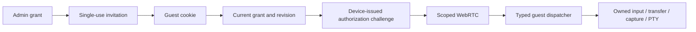

# Temporary Browser Access

Status: scoped guest implementation, 2026-10-03. Invitations, the admin editor,
revision-bound WebRTC, typed device operations, exchange files, media, capture
ownership and root PTYs are implemented in source. Runtime qualification and
production deployment are separate gates; see the verification section.
Native controller applications retain their existing v1 scopes.

## Decision And Authority

An administrator grants access to one approved device until an absolute deadline.
A single-use invitation becomes a separate browser session without an admin
login. SQLite owns the grant and revision; the relay checks its current state,
and the device enforces the protected policy on every channel and operation.
The browser shows permitted tools but cannot grant authority.

The guest client reuses `web/` through a dedicated entry. It never mounts owner
panels or forwards arbitrary owner HTTP paths. The existing owner proxy, file
channel, scripts and terminal tunnel remain independently authenticated.
A second identity provider or policy service would add dependencies without
solving the device-side authorization boundary. Multiple relay instances would
require shared revocation/routing; this design assumes the existing single relay.

## Invitation And Browser Session

```text
https://relay.example/share/<random-invitation-id>#<256-bit-random-secret>
```

Neither value contains a device identifier. Device IDs are routing identifiers,
not passwords, but omitting them reduces unnecessary disclosure. Store only a
keyed, domain-separated hash of the secret; return plaintext once. QR generation
is local. Link possession permits the first claim; the label is not verified
identity. Forwarding/interception before claim remains possible.

GET serves a small first-party shell and never consumes the invitation. The
shell removes the fragment immediately with `history.replaceState`. It does
not persist credentials in local/session storage, analytics or third-party
resources. Use no-store, no-referrer, frame blocking and a restrictive CSP.
A fragment stays visible to browser extensions and the application carrying the
link; it is not intrinsically leak-proof.

An explicit Join uses same-origin JSON POST. A transaction validates the unused,
unrevoked invitation, approved device, capabilities, limits and deadline before
creating the session. Lost claim responses recover only with the same short-lived
claim binding. Recovery rotates the credential and is bounded/acknowledged.
It cannot create a second guest or extend expiry.

Guest credentials use a separate host-only Secure/HttpOnly/SameSite=Strict cookie.
Guest endpoints ignore admin cookies; admin endpoints never accept guest cookies.
Origin validation protects mutations and WebSocket handshakes independently of
SameSite. Session credentials are bearer credentials, unlike native-controller
P-256 proofs. XSS or a stolen active cookie remains a relevant threat.

## Permissions

The enabled registry is [guest-permissions.json](../protocol/guest-permissions.json).
Generated identifiers serve Go, C++ and both web clients. Unknown permissions
and operations fail closed. View only expands to `screen.view`; it implies no
input, clipboard, camera, microphone, file or package access. Screenless grants
are valid. Native controller scopes never widen guest permissions.

| Group | Enabled permissions | Boundary |
| --- | --- | --- |
| Screen | `screen.view`, `screen.snapshot` | Live screen and one-shot PNG are independent; a snapshot works without a screen stream |
| Input | `input.touch`, `input.pointer`, `input.keyboard`, `input.text` | Owned touch, relative mouse, validated keyboard HID, bounded US keyboard text; no arbitrary HID sentinels |
| Buttons | `input.button.home`, `input.button.lock`, `input.button.volume`, `input.button.system_ui` | Home, lock, volume, Control Center/notifications are independently checked; keyboard Power/Volume cannot bypass these grants |
| Device | `device.info`, `device.diagnostics`, `device.brightness`, `device.orientation` | Information excludes personal name and hardware identifiers; diagnostics exclude network addresses/configuration; settings are explicit typed operations |
| Clipboard | `clipboard.read`, `clipboard.write` | Independent read and replacement, limited to 4 KiB text |
| Applications | `apps.list`, `apps.launch`, `apps.open_url` | Validated bundle IDs; web links require HTTP(S), a host and no embedded credentials |
| Sound | `audio.playback.listen`, `audio.microphone.listen`, `audio.microphone.record`, `audio.output` | Playback and room microphone are separate channels; recording and output changes are separate rights |
| Talk | `talk.speaker`, `talk.virtual_microphone` | Per-session speaker/app-microphone route; both requires both permissions |
| Camera | `camera.live`, `camera.snapshot`, `camera.record` | Live video, foreground-app still photo and recording are independent; recording requires an owned active camera |
| Captures | `capture.download` | Export only this session's recordings; snapshot save controls are separate from capture creation |
| Media | `media.browse`, `media.preview`, `media.download`, `media.delete` | Opaque asset IDs, JPEG derivatives and video thumbnails, original export/playback, Photos deletion with owned confirmation |
| Files | `files.list`, `files.preview`, `files.download`, `files.upload`, `files.overwrite`, `files.delete` | Only the fixed exchange folder; directions and overwrite are separate; no arbitrary root/path grants |
| Automation | `automation.macros` | Browser recording/playback of permitted input; every event still needs touch/keyboard rights and the current lease |
| System | `system.inventory`, `system.package_download`, `system.tweak_toggle`, `system.package_remove`, `system.respring` | Reviewed inventory, selected tweak library export, transactional toggle, protected package removal and respring; destructive actions need owned confirmation |
| Terminal | `terminal.root` | An owned root PTY. This explicitly grants full device administration |

`system.package_download` exports an existing selected tweak dylib, not a rebuilt
Debian package or arbitrary package paths. A disabled library can be enabled
through the separate toggle permission. System inventory is paginated.

Media previews are rendered derivatives; `media.download` is required for
original video playback. No full video transcoding service is implied. Text
file previews are limited to 2 MiB. Browser previews are bounded to 64 MiB;
streamed saving uses File System Access when available, with a 256 MiB bounded
fallback. Uploads are limited to 512 MiB and use 24 KiB chunks.

Device updates, package installation, arbitrary root files and global feedback
FX remain owner workflows. Updating the authority/transport or installing root
code is not a narrow guest tool. Root terminal and package removal already carry
an explicit full-authority consequence. Package installation and device-side
screen-video recording are not implemented product features. Input macros are
not screen-video recording. No checkbox advertises those absent workflows.

## Enforcement And Transport



The guest capability `guest.scoped_sessions_v1` protects screen/input. The new
`guest.operations_v1` capability is required for additional rights and screenless
sessions. An old/downgraded device is refused before opening unsupported channels.
The authenticated relay envelope supplies rights, revision and internal owner;
RPC arguments never supply principal, permissions, deadline or device ID.

`/api/guest/signal` opens screen, camera or operations roles. Screen requires
`screen.view`; camera requires `camera.live`; operations supports data-only
sessions. The device creates only authorized channels. The reliable
`guest-operations` channel invokes a closed typed operation table; raw HTTP
paths, scripts, pointer/file owner tokens and generic proxying are unavailable.
See [the operation contract](../protocol/guest-operations-v1.md).

The dispatcher checks the current bridge lease before execution and after
asynchronous results. Internal admitted file descriptors are adopted before a
cancellation check, so a cancelled export cannot leak its descriptor. SpringBoard
commands retain owner and a sleep-inclusive deadline through the queue. Retired
owner tombstones reject delayed commands and held-input renewals.

Default guest ICE is TURN-only on both device and browser. This reduces disclosure
of the device's network addresses. Explicit direct ICE is an owner policy;
a modified browser cannot widen device policy. Missing TURN fails visibly.
There is no guest legacy HTTP/stream fallback. TURN credentials are temporary
transport credentials and do not confer device authority.

## Immediate Changes And Revocation

Admin permission edits use compare-and-swap revisions. An unchanged set is a
no-op; a changed set first persists the new revision, then closes every old
session socket and sends protected device retirement. The current cookie can
reconnect manually with current permissions; old sessions cannot continue.
Revoke/end/expiry permanently invalidate the invitation and browser credential.
Revoke all includes unused invitations. No operation silently extends a grant.

The relay does not wait for the guest browser to acknowledge a close frame.
The device marks its lease retired before draining sends and work. Pending
commands cannot renew old authority or receive late replies. The guest clears
screen/camera/video previews, transfers, local playback buffers, microphone
capture, macros and terminal on authorization loss; it never automatically
rejoins with prior permissions.

The admin response distinguishes confirmed device retirement from an unconfirmed
cleanup. An ACK is issued only after media sends are fenced, held input released,
owned dispatcher work drained and capture/PTY resources released. A timeout or
partition never becomes a false success. A protected device-issued challenge
renews only the current grant/hash/revision and has a maximum 20-second lease.
During a partition, immediate delivery is physically impossible; device leases
bound continued access and cannot be renewed by browser heartbeats.

Already delivered bytes cannot be withdrawn. An accepted Photos deletion,
application launch or package-manager transaction cannot be undone by revocation.
Package removal drains to completion instead of killing dpkg halfway through.
Retirement remains unconfirmed until accepted work finishes. Root shell commands
can deliberately create persistent processes/changes; closing their PTY is not
an OS sandbox or rollback mechanism.

## Resource Ownership

- **Input:** one guest input owner, validated usages/coordinates and bounded
  rate/buffers. Owner input retains priority. Release only keys/contacts held by
  that guest. Relative pointer identity is derived on-device; browser tokens
  cannot release another owner's lease. Pointer loss/backgrounding releases it.
- **Transfers:** at most four admitted read descriptors, one owned upload and
  two pending operations per device session. RPC is at most 48 KiB; replies at
  most 64 KiB. Browser requests have a bounded queue and reject on backpressure.
  Handles cannot cross sessions or be converted into paths.
- **Exchange:** `/var/mobile/Library/Caches/com.greatlove.rctl/exchange`, a
  root-owned private runtime folder common to rootful/rootless. Even its fixed
  parent path is opened component by component without following symlinks.
  Relative walks reject traversal, hidden entries, symlinks, hardlinks and
  special files. New uploads use private temporary files, fsync and atomic
  no-replace commit. Overwrite requires both permissions; cancel/end removes
  partial files. Ordinary grants cannot reach relay credentials or code roots.
- **Media:** only indexed opaque asset IDs enter the adapter. Path/UUID metadata
  is removed. Originals and JPEG derivatives have distinct operations. Photos
  deletion resolves an admitted UUID internally and uses protected queued work.
- **Confirmations:** single-use, session-owned tokens bind exact operation and
  arguments for 30 seconds. Another session, target, revision or operation
  cannot reuse them. Existing owner confirmation state is not delegated.
- **Audio/recordings:** reserve shared native capture primitives exclusively.
  Owner mutations return a busy response until the guest is revoked; they
  cannot overwrite a guest artifact or feed owner recordings into it. Stopping
  a recording retains its reservation until session end. Recordings stop after
  five minutes, 256 MiB, or low disk space. Export stops the
  owned recording and opens its admitted descriptor; end deletes the artifact.
  Talk route and active playback burst belong to the session. Virtual-mic
  routing is independent of the owner setting; teardown fences queued PCM,
  closes old clients and clears app rings. Device output is
  restored only when it still matches the guest's last output setting.
- **Camera:** still photos use a single-use app ticket, generation/deadline,
  private upload and explicit stop ACK. Live-camera agents register generations
  before starting and acknowledge them after stopping their capture/encoder.
  Confirmed process exit also retires its capture; a live/reused PID or failed
  acknowledgement stays pending. Pending generations block confirmed retirement. Late JPEGs and frames cannot
  reach a replacement guest. Camera needs a supported foreground application.
- **Terminal:** one explicitly opened PTY per session, validated dimensions,
  bounded nonblocking reads/writes. No inherited relay/configuration FD reaches
  the shell. End closes the PTY, terminates its shell and foreground process
  groups, and waits for its child. No processes are killed by name.

## Product Limits

Screen permission exposes everything visible on the device. A viewer can retain
pixels and any preview already received, regardless of save-button availability.
Touch/keyboard/text can operate Settings, share data through another application
or open that application's terminal. These permissions constrain rctl APIs,
not arbitrary iOS application semantics. Do not describe them as an OS sandbox.

Root terminal and package removal can execute root code, including lifecycle
scripts, and are effectively device administration. A compromised relay admin
remains trusted authority. Independent LAN access remains useful and unauthenticated:
a recipient able to reach the LAN port could bypass relay restrictions. Explain
this condition and the existing explicit persisted Relay-only policy; never
silently enable it or fall back to a guessed LAN address.

## Interfaces And Verification

Admin APIs create/list/edit/revoke one/revoke all/delete terminal grants. Guest
APIs provide prepare/claim/claim ACK/session/end/signaling/control. No guest route
contains a device ID. The admin editor groups the explicit registry, shows the
count and View only preset, disables advanced rights on unsupported devices and
explains root-terminal authority. The guest mounts only scoped tools and shows
busy, denied, unsupported, expired and disconnected states.

Source commit `5847fb7` was locally checked with Go race/vet, 34 existing protocol
fixtures, 49 web tests, both SPA builds/admin lint, native permission/ownership/
Talk tests and rootful iOS 14 arm64/arm64e build/staging. Disposable Chrome tested
Join/fragment removal/edit/revoke and unsupported devices using a fake signaling
peer; it did not qualify physical video/input. SYSV fakeroot failed on the host;
assembly from staging with `dpkg-deb --root-owner-group` passed the package audit.
No deploy/install was part of that source commit. Retain that evidence as the
initial implementation record, not as qualification of subsequent changes.

Expanded local verification on 2026-10-03 passed Go race/vet, 54 browser unit
checks, both SPA builds/admin lint, 34 protocol fixtures/generator drift, the
full native test suite and production WebRTC ownership/Talk tests. Virtual-mic
queue tests prove routing without changing the owner mode, retirement of old
clients and rejection of frames from an old generation. Typed
requests prove permission denial, owned transfer/confirmation isolation,
no-overwrite commit and cancellation; camera tests prove per-agent stop,
generation replay rejection and confirmed process exit. Rootful iOS 14 and
rootless iOS 15 arm64/arm64e staging passed. Disposable Chrome with synthetic
RTC checked files without screen authority, bounded text preview, revocation
removing tools/data, playback-only visibility and mobile layout. These browser
fixtures do not qualify physical media or input.

The configured rootless test device is reachable as an ordinary user, but the
independent SSH install requires operator sudo authentication. No device
installation or physical expanded-feature acceptance is recorded here yet.
Relay deployment remains a separate exact-artifact acceptance gate.

Expanded operations require exact-build verification of: independent channels,
forged/denied requests, cross-session confirmations/transfers, path and symlink
escapes, no-overwrite commit, cancellation/expiry during transfers/input/macros/
recording/PTY, camera stop acknowledgements, old-device refusal, owner/native
compatibility, relay loss/reconnect, and rootful/rootless runtime paths.
A successful native compile is not physical audio/camera/input evidence.

Build `relay/web-admin` before compiling the Go relay so embedded assets are
current. Package staging rebuilds the device client. Qualify exact relay and
device builds together; do not install old assets with new guest routes.
Use disposable databases/fixtures. Production deployment requires backup,
SQLite integrity, verified artifact identity, atomic replacement, relay/proxy/
TURN health and an authenticated device tunnel, with rollback on failure.
A rollback makes guest state inert; it never translates guest credentials to
admin sessions. Unsupported permission paths remain unqualified.

Related contracts: [architecture](ARCHITECTURE.md), [controller authentication](CONTROLLER-AUTH.md),
[signaling](../protocol/signaling-v1.md), [media](MEDIA.md), [camera](CAM.md),
[audio](AUDIO.md), [terminal](TERMINAL.md), and [development](DEVELOPMENT.md).
